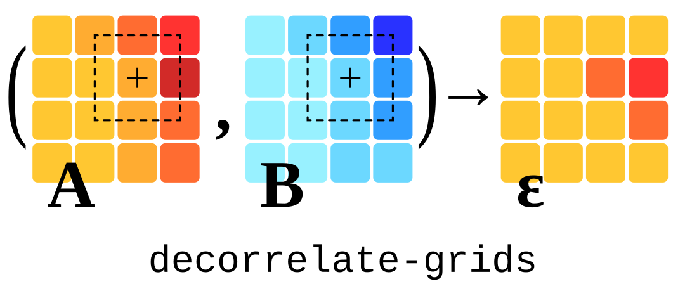

# decorrelate-grids

[](https://www.repostatus.org/#concept)



Provided with two 2-D labelled arrays ( $\mathbf{A}, \mathbf{B}$ "grids"), perform a windowed linear regression between the two and return the fitted coefficients, as grids.
The aim is pursuing the removal of any (linearly) correlated component between the data in $\mathbf{A}$ and $\mathbf{B}$, assuming that their linear relationship varies spatially - hence the rolling window.
Array $\mathbf{\epsilon}$ is an array of "regression residuals", the result of subtracting the fitted relationship from $\mathbf{A}$.

This was designed with a specific application in mind: mitigation of tropospheric delays in Interferometric Synthetic Aperture Radar (InSAR) data (see e.g. [Bevis et al., 1992](https://doi.org/10.1029/92JD01517); [Tymofyeyeva and Fialko, 2015](https://doi.org/10.1002/2015JB011886); [Adam, 2019](10.1109/JSTARS.2019.2957919); and chapter 4.6 in [ESA EGMS Algorithm Theoretical Basis Document, 2021](https://land.copernicus.eu/user-corner/technical-library/egms-algorithm-theoretical-basis-document)).
There, the unwrapped phase (the _response variable_, in the context of regression) is observed to be correlated with topography (an _explanatory variable_), a phenomenon which can be attributed in part to non-modelled propagation delays.
Among the mitigation strategies, the unwrapped phase can be de-correlated with respect to topography. Ideally, with all the due simplification of this context, this would reveal only the phase caused by deformation of the Earth surface.
This was actually set up to test if this is effective and how does it compare to other strategies.

However, **no part of this package is InSAR-specific**. The procedure can be applied to any data with similar goals of de-correlation.
Using the result of windowed regression by itself is also a possibility, as it is customarily done in some applications (e.g. topography-gravity regression in geophysics, see e.g. [Pivetta and Braitenberg, 2020](https://doi.org/10.1016/j.tecto.2019.228299)).
Nevertheless, some assumptions and implementation choices reflect our original aim.
Chiefly, data formats: the script reads and writes netCDF files, using xarray.
The core procedure works regardless of this, hence moving on to a format-agnostic implementation is in the To Do list.

At the moment, only ordinary-least-squares linear regression is implemented as "correlation model".
We deemed this enough for the application we were concerned with.
Extension to other models or refactoring to allow any function to be used would be an interesting improvement.

## Method

<!-- Note: to get consistent rendering of math in github markdown, we are escaping some underscores "_" as "\_" (case: terms with both subscripts and superscripts, subscripts with other operators) -->

Assuming variable $a$ and $b$ are in a relation in the form:

$$a(b) = f(b) + \epsilon$$

our goal is to estimate $f(b)$, thus the _regression residuals_ $\epsilon$.

We choose a simple linear model for $f(b)$:

$$f(b) = c_0 + b * c_1$$

and we will assume that in each neighbourhood of an element in our arrays this is the model describing the unwanted "correlated component" of the observed signal $a$.

The least square system for each $\mathbf{A}(i, j)$, $\mathbf{B}(i, j)$ element of the input arrays, which share the same $m \times n$ size, is:

$$\hat{A}\_{i, j}^{o, p} = c_{0_{i, j}} + \hat{B}\_{i, j}^{o, p} * c\_{1\_{i, j}}$$

where $\hat{A}\_{i, j}^{o, p}$ and $\hat{B}\_{i, j}^{o, p}$ are each a vector of $\mathbf{A}$ and $\mathbf{B}$ elements in the neighourhood (rolling window) of $i, j$, defined by a "window half width" of $m, n$ rows and columns:

$$
\hat{A}_{i, j}^{o, p} =
  \left[
    a\_{i-o, j-p}, \dots, a\_{i+o, j-p},
    \dots,
    a\_{i-o, j+p}, \dots, a\_{i+o, j+p}
  \right]
$$

Note that we are using a boxcar-shaped window, but the weights of any windowing function may be employed in a weighted least squares scheme.

No regression is carried out on elements on the edges (where one or more of the following is true: $i-o < 0$, $i+o > m$, $j-p < 0$, $j+p > n$) and elements in which $\mathbf{A}(i, j)$ or $\mathbf{B}(i, j)$ is $\mathtt{NaN}$.

### Notation choices

We used $c$ for denoting the regression parameters, rather than the commonly used $\beta$, for familiarity with $c$ as in _coefficients_.

This left with a risk of confusion with the _residuals matrix_, which could not be $\mathbf{C}$ - since we do have arrays of fitted coefficients.
Notation clashes arised for any other letter we tought of (e.g. $\mathbf{R}$, but there is an array of $r$ coefficients of determination).
Since $\epsilon$ is used in some places for regression residuals, we went with that (e.g. $Y = X \beta + \epsilon$ in _Hastie et. al, Elements of statistical learning_, Eq. 3.23).

Arguably, the logo graphics would have been nicer as $(\mathbf{A}, \mathbf{B}) \rightarrow \mathbf{C}$.

## Try it out

At this early stage, this boils down to:

1. Clone this repository:

```
git clone https://github.com/apasto/decorrelate-grids.git
```

2. Create and activate its Conda environment:

```
conda env create -f environment.yml
conda activate linreg-grids
```

3. Print out a short usage help:

```
./linreg-grids.py -h
```

## Roadmap

This is currently at a working, but crude state.
Some steps are needed to get to a tidy, maintainable and packaged state.
See this task list: [issue #2][i2].

## License

This work is licensed under the Apache License 2.0. See [LICENSE](./LICENSE).

[i2]: https://github.com/apasto/decorrelate-grids/issues/2
